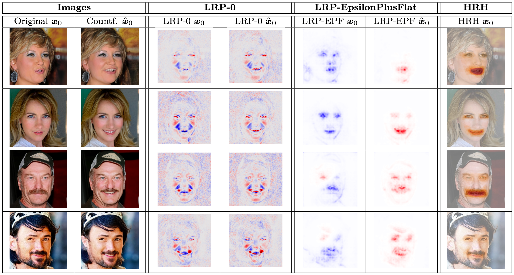

<!-- Improved compatibility of back to top link: See: https://github.com/othneildrew/Best-README-Template/pull/73 -->
<a id="readme-top"></a>
<!--
*** Thanks for checking out the Best-README-Template. If you have a suggestion
*** that would make this better, please fork the repo and create a pull request
*** or simply open an issue with the tag "enhancement".
*** Don't forget to give the project a star!
*** Thanks again! Now go create something AMAZING! :D
-->


<!-- PROJECT SHIELDS -->
<!--
*** I'm using markdown "reference style" links for readability.
*** Reference links are enclosed in brackets [ ] instead of parentheses ( ).
*** See the bottom of this document for the declaration of the reference variables
*** for contributors-url, forks-url, etc. This is an optional, concise syntax you may use.
*** https://www.markdownguide.org/basic-syntax/#reference-style-links
-->
[![MIT License][license-shield]][license-url]
[![LinkedIn][linkedin-shield]][linkedin-url]


<!-- PROJECT LOGO -->
<br />
<div align="center">
  <a href="https://github.com/othneildrew/Best-README-Template">
    
  </a>

  <h3 align="center">Diffusion Visual Counterfactual Explanations <br> & <br> Human Relevance Heatmaps</h3>

  <p align="center">
    <br />
    <a href="https://github.com/cederican/DataSciPro/issues">Report Bug</a>
    ·
    <a href="https://github.com/cederican/DataSciPro/issues">Request Feature</a>
  </p>
</div>


<!-- TABLE OF CONTENTS -->
<details>
  <summary>Table of Contents</summary>
  <ol>
    <li>
      <a href="#about-the-project">About The Project</a>
      </ul>
    </li>
    <li>
      <a href="#getting-started">Getting Started</a>
      <ul>
        <li><a href="#prerequisites">Prerequisites</a></li>
        <li><a href="#installation">Installation</a></li>
        <li><a href="#compute-requirements">Compute requirements</a></li>
        <li><a href="#dvce-generation">DVCE generation</a></li>
        <li><a href="#xai-crp-analysis">XAI CRP analysis</a></li>
        <li><a href="#training-of-the-classifiers">Training of the classifiers</a></li>
        <li><a href="#evaluation-of-the-user-study">Evaluation of the user study</a></li>
      </ul>
    </li>
    <li><a href="#usage">Usage</a></li>
    <li><a href="#license">License</a></li>
    <li><a href="#contact">Contact</a></li>
    <li><a href="#acknowledgments">Acknowledgments</a></li>
  </ol>
</details>


<!-- ABOUT THE PROJECT -->
## About The Project

This project focuses on Diffusion Visual Counterfactual Explanations (DVCE) and Human Relevance Heatmaps (HRH). Developed during a master's data science project at the Technical University of Berlin, it aims to enhance the understanding of classifier decisions through visualization techniques.

A key component of this project is a user study designed to evaluate visual counterfactual explanations from a human-centered perspective. This study aims to assess how effectively these explanations can be understood and interpreted by users.

Additionally, the project includes a model for smiling enhancement, which serves as a practical example to explore and demonstrate the decision-making processes of classifiers such as Linear models and ResNet50. Machine evaluation metrics, LRP (Layer-wise Relevance Propagation) and CRP (Contextual Relevance Propagation), developed at TU Berlin, are employed to rigorously evaluate the explanations provided by our models.

<p align="right">(<a href="#readme-top">back to top</a>)</p>


<!-- GETTING STARTED -->
## Getting Started

To get a local copy follow these simple steps.

### Prerequisites

Create a conda environment using 
* conda environment
  ```sh
  conda env create -f environment.yml
  ```

### Installation

* clone the repo
   ```sh
   git clone https://github.com/cederican/DataSciPro.git
   ```

### Compute requirements

* inference was performed on
   ```sh
   1x NVIDIA A100 40GB GPU memory
   ```

### DVCE generation

* use test data from the CelebA dataset provided under
   ```sh
   data/test_counterfactual
   ```

* download the provided checkpoints for the classifiers (Linear, ResNet50)
from [Checkpoints](https://tubcloud.tu-berlin.de/s/iWoFaXpzzkrXJQF)

* create a folder to store the checkpoints and change the path to the model in diffCounterfactuals.ipynb
   ```sh
    if cls_type == 'linear':    
        classifier = LinearClassifier.load_from_checkpoint("<path_to_checkpoint_file>",
                                      input_dim = data[0]['img'].shape,
                                      num_classes = len(CelebHQAttrDataset.id_to_cls))
    elif cls_type == 'res50':
        classifier = ResNet50Classifier.load_from_checkpoint("<path_to_checkpoint_file>",
                                      num_classes = len(CelebHQAttrDataset.id_to_cls))
   ```

* create a folder to store the results and change the path in diffCounterfactuals.ipynb
   ```sh
   directory_name = os.path.join("<path_to_output_folder>", f'folder_IMG_{img_index}')
   ```

* choose a classifier type in diffCounterfactuals.ipynb
   ```sh
   cls_type = 'linear' # or 'res50'
   ```

* run the jupyter notebook
   ```sh
   diffCounterfactuals.ipynb
   ```

### XAI CRP analysis

* use test data provided under
   ```sh
   data/test_crp
   ```

* change the ResNet50 checkpoint path and the feature visualization path in xai_crp.ipynb
   ```sh
  model = ResNet50Classifier.load_from_checkpoint("<path_to_checkpoint_file>",
                              num_classes = len(CelebHQAttrDataset.id_to_cls)) 

  fv_path = "<path_to_a_new_folder_in_DataSciPro>"  
   ```

* download the provided CelebA datasets for a global CRP analysis from [Image Data](https://tubcloud.tu-berlin.de/s/sjMbBqHMPPJfExg), [Label Data](https://tubcloud.tu-berlin.de/s/zNnJDzwFTCYPx49)

* change the data_path and the attr_path in xai_crp.ipynb
   ```sh
   data_path = '<path_to_celebahq256.lmdb>'
   attr_path = '<path_to_CelebAMask-HQ-attribute-anno.txt>'
   ```

* run the jupyter notebook
   ```sh
   xai_crp.ipynb
   ```

### Training of the classifiers

Or you can train the classifiers by yourself, therefore you do not need the .ckpt files

* make sure you downloaded the provided CelebA datasets
   ```sh
   some TUB Cloud Link!!!!!!!!
   ```

* change the data_path and the attr_path in train_classifier.py
   ```sh
   data_path = '<path_to_celebahq256.lmdb>'
   attr_path = '<path_to_CelebAMask-HQ-attribute-anno.txt>'
   ```

* adjust the config and note that [WandB](https://wandb.ai/site) is used as a logger
   ```sh
   classifier/train_config.py
   ```

* run the python file
   ```sh
   classifier/train_classifier.py
   ```

### Evaluation of the user study

Some results from both tasks of the user study are provided here and the script to evaluate the data. If you are interested in the study data, please contact us.

* study results and evaluation script in
   ```sh
   study/results/eval_annotation
   study/results/eval_selection

   study/evalstudy.py
   ```


<p align="right">(<a href="#readme-top">back to top</a>)</p>


<!-- USAGE EXAMPLES -->
## Usage

The model enables you to create DVCEs and the corresponding LRP heatmaps. Some examples are shown here and compared to the human created human relevance heatmaps.



_For more examples, please refer to the [Link to the Paper](https://example.com)_

<p align="right">(<a href="#readme-top">back to top</a>)</p>


<!-- LICENSE -->
## License

Distributed under the MIT License. See `LICENSE.txt` for more information.

<p align="right">(<a href="#readme-top">back to top</a>)</p>


<!-- CONTACT -->
## Contact

Cederic Aßmann - cederic.assmann@icloud.com

Project Link: [https://github.com/cederican/DataSciPro](https://github.com/cederican/DataSciPro)

<p align="right">(<a href="#readme-top">back to top</a>)</p>


<!-- ACKNOWLEDGMENTS -->
## Acknowledgments

Helpful projects and pretrained models used in the project

* [CompVis ldm-celebahq-256 models](https://huggingface.co/CompVis/ldm-celebahq-256)
* [Helpful for CelebA dataset handling](https://github.com/phizaz/diffae)
* [WandB](https://wandb.ai/site)
* [Diffusers](https://huggingface.co/docs/diffusers/index)

<p align="right">(<a href="#readme-top">back to top</a>)</p>


<!-- MARKDOWN LINKS & IMAGES -->
<!-- https://www.markdownguide.org/basic-syntax/#reference-style-links -->
[license-shield]: https://img.shields.io/github/license/othneildrew/Best-README-Template.svg?style=for-the-badge
[license-url]: /Users/cedimac/DataScPro/EvalStudy/LICENSE.txt
[linkedin-shield]: https://img.shields.io/badge/-LinkedIn-black.svg?style=for-the-badge&logo=linkedin&colorB=555
[linkedin-url]: https://www.linkedin.com/in/cederic-aßmann-41904322b/
